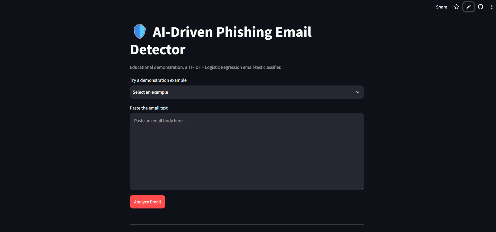

# 🛡️ AI-Driven Phishing Email Detection using NLP

An AI-powered phishing email detection system that uses **Natural Language Processing (NLP)** and **Machine Learning** to classify emails as **Phishing** or **Legitimate**.

## 🌐 Live Demo

🚀 Try the application here:

👉 https://ai-driven-phishing-email-detector.streamlit.app/

---

## 📌 Project Overview

Phishing emails are one of the most common cybersecurity threats. This project uses Machine Learning and NLP techniques to analyze email text and identify potentially malicious phishing emails.

The system uses **TF-IDF Vectorization** and **Logistic Regression** to classify email content.

---

## ✨ Features

- 🚨 Detects phishing emails
- ✅ Identifies legitimate emails
- 📊 Displays model confidence
- 📈 Shows estimated phishing probability
- 🔍 Provides phishing-related keyword insights
- 🌐 Interactive Streamlit web application
- ⚡ Real-time email analysis

---

## 🛠️ Technologies Used

- Python
- Natural Language Processing (NLP)
- Machine Learning
- Scikit-learn
- TF-IDF Vectorization
- Logistic Regression
- Streamlit
- Git & GitHub

---

## 🧠 How It Works

Email Input
    ↓
Text Preprocessing
    ↓
TF-IDF Vectorization
    ↓
Logistic Regression Model
    ↓
Prediction
    ↓
Phishing / Legitimate Result

## 📸 Application Screenshots

### 🏠 Home Page

### ✅ Legitimate Email Detection

### 🚨 Phishing Email Detection

